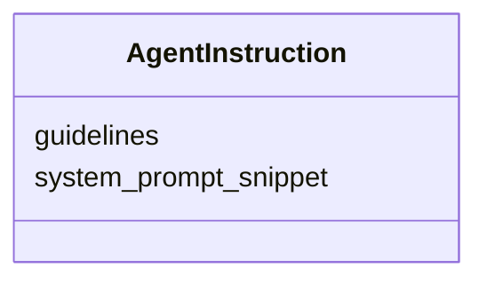

---
search:
  boost: 10.0
---

# Class: AgentInstruction


_Machine and agentic parsing, transformation, or reasoning guidelines._


<div data-search-exclude markdown="1">


URI: [sdt:AgentInstruction](https://w3id.org/dartfx/semanticdt/AgentInstruction)





<!-- no inheritance hierarchy -->

## Slots

| Name | Cardinality and Range | Description | Inheritance |
| ---  | --- | --- | --- |
| [guidelines](guidelines.md) | 1 <br/> [String](String.md) | Text instructions for agents | direct |
| [system_prompt_snippet](system_prompt_snippet.md) | 0..1 <br/> [String](String.md) | System prompt instructions for configuring agents with this data type | direct |


## Usages

| used by | used in | type | used |
| ---  | --- | --- | --- |
| [SemanticDataType](SemanticDataType.md) | [agent_instructions](agent_instructions.md) | range | [AgentInstruction](AgentInstruction.md) |


## Identifier and Mapping Information


### Schema Source


* from schema: https://w3id.org/dartfx/semanticdt


## Mappings

| Mapping Type | Mapped Value |
| ---  | ---  |
| self | sdt:AgentInstruction |
| native | sdt:AgentInstruction |


## LinkML Source

<!-- TODO: investigate https://stackoverflow.com/questions/37606292/how-to-create-tabbed-code-blocks-in-mkdocs-or-sphinx -->

### Direct

<details>
```yaml
name: AgentInstruction
description: Machine and agentic parsing, transformation, or reasoning guidelines.
from_schema: https://w3id.org/dartfx/semanticdt
attributes:
  guidelines:
    name: guidelines
    description: Text instructions for agents.
    from_schema: https://w3id.org/dartfx/semanticdt
    rank: 1000
    domain_of:
    - AgentInstruction
    required: true
  system_prompt_snippet:
    name: system_prompt_snippet
    description: System prompt instructions for configuring agents with this data
      type.
    from_schema: https://w3id.org/dartfx/semanticdt
    rank: 1000
    domain_of:
    - AgentInstruction

```
</details>

### Induced

<details>
```yaml
name: AgentInstruction
description: Machine and agentic parsing, transformation, or reasoning guidelines.
from_schema: https://w3id.org/dartfx/semanticdt
attributes:
  guidelines:
    name: guidelines
    description: Text instructions for agents.
    from_schema: https://w3id.org/dartfx/semanticdt
    rank: 1000
    owner: AgentInstruction
    domain_of:
    - AgentInstruction
    range: string
    required: true
  system_prompt_snippet:
    name: system_prompt_snippet
    description: System prompt instructions for configuring agents with this data
      type.
    from_schema: https://w3id.org/dartfx/semanticdt
    rank: 1000
    owner: AgentInstruction
    domain_of:
    - AgentInstruction
    range: string

```
</details></div>
