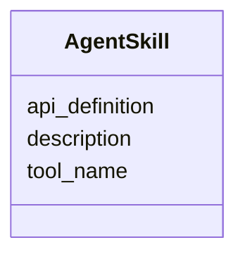

---
search:
  boost: 10.0
---

# Class: AgentSkill


_Executable tools, functions, or workflows related to the semantic type._


<div data-search-exclude markdown="1">


URI: [sdt:AgentSkill](https://w3id.org/dartfx/semanticdt/AgentSkill)





<!-- no inheritance hierarchy -->

## Slots

| Name | Cardinality and Range | Description | Inheritance |
| ---  | --- | --- | --- |
| [tool_name](tool_name.md) | 1 <br/> [String](String.md) | Name of the tool or function | direct |
| [description](description.md) | 0..1 <br/> [String](String.md) | What this skill does | direct |
| [api_definition](api_definition.md) | 0..1 <br/> [String](String.md) | API endpoint or function signature | direct |


## Usages

| used by | used in | type | used |
| ---  | --- | --- | --- |
| [SemanticDataType](SemanticDataType.md) | [agent_skills](agent_skills.md) | range | [AgentSkill](AgentSkill.md) |


## Identifier and Mapping Information


### Schema Source


* from schema: https://w3id.org/dartfx/semanticdt


## Mappings

| Mapping Type | Mapped Value |
| ---  | ---  |
| self | sdt:AgentSkill |
| native | sdt:AgentSkill |


## LinkML Source

<!-- TODO: investigate https://stackoverflow.com/questions/37606292/how-to-create-tabbed-code-blocks-in-mkdocs-or-sphinx -->

### Direct

<details>
```yaml
name: AgentSkill
description: Executable tools, functions, or workflows related to the semantic type.
from_schema: https://w3id.org/dartfx/semanticdt
attributes:
  tool_name:
    name: tool_name
    description: Name of the tool or function.
    from_schema: https://w3id.org/dartfx/semanticdt
    rank: 1000
    domain_of:
    - AgentSkill
    required: true
  description:
    name: description
    description: What this skill does.
    from_schema: https://w3id.org/dartfx/semanticdt
    domain_of:
    - SemanticDataType
    - AgentSkill
    - GeospatialCoverage
    - TemporalCoverage
    - Example
  api_definition:
    name: api_definition
    description: API endpoint or function signature.
    from_schema: https://w3id.org/dartfx/semanticdt
    rank: 1000
    domain_of:
    - AgentSkill

```
</details>

### Induced

<details>
```yaml
name: AgentSkill
description: Executable tools, functions, or workflows related to the semantic type.
from_schema: https://w3id.org/dartfx/semanticdt
attributes:
  tool_name:
    name: tool_name
    description: Name of the tool or function.
    from_schema: https://w3id.org/dartfx/semanticdt
    rank: 1000
    owner: AgentSkill
    domain_of:
    - AgentSkill
    range: string
    required: true
  description:
    name: description
    description: What this skill does.
    from_schema: https://w3id.org/dartfx/semanticdt
    owner: AgentSkill
    domain_of:
    - SemanticDataType
    - AgentSkill
    - GeospatialCoverage
    - TemporalCoverage
    - Example
    range: string
  api_definition:
    name: api_definition
    description: API endpoint or function signature.
    from_schema: https://w3id.org/dartfx/semanticdt
    rank: 1000
    owner: AgentSkill
    domain_of:
    - AgentSkill
    range: string

```
</details></div>
