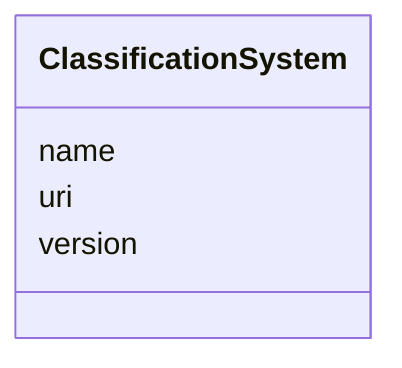

---
search:
  boost: 10.0
---

# Class: ClassificationSystem


_Controlled vocabulary or coding scheme (making this a categorical variable)._


<div data-search-exclude markdown="1">


URI: [sdt:ClassificationSystem](https://w3id.org/dartfx/semanticdt/ClassificationSystem)





<!-- no inheritance hierarchy -->

## Slots

| Name | Cardinality and Range | Description | Inheritance |
| ---  | --- | --- | --- |
| [name](name.md) | 1 <br/> [String](String.md) | Name of the classification (e | direct |
| [uri](uri.md) | 0..1 <br/> [String](String.md) | URI to the standard classification | direct |
| [version](version.md) | 0..1 <br/> [String](String.md) | Version of the classification scheme | direct |


## Usages

| used by | used in | type | used |
| ---  | --- | --- | --- |
| [SemanticDataType](SemanticDataType.md) | [classification](classification.md) | range | [ClassificationSystem](ClassificationSystem.md) |


## Identifier and Mapping Information


### Schema Source


* from schema: https://w3id.org/dartfx/semanticdt


## Mappings

| Mapping Type | Mapped Value |
| ---  | ---  |
| self | sdt:ClassificationSystem |
| native | sdt:ClassificationSystem |


## LinkML Source

<!-- TODO: investigate https://stackoverflow.com/questions/37606292/how-to-create-tabbed-code-blocks-in-mkdocs-or-sphinx -->

### Direct

<details>
```yaml
name: ClassificationSystem
description: Controlled vocabulary or coding scheme (making this a categorical variable).
from_schema: https://w3id.org/dartfx/semanticdt
attributes:
  name:
    name: name
    description: Name of the classification (e.g., ISO-3166-1, ICD-10).
    from_schema: https://w3id.org/dartfx/semanticdt
    domain_of:
    - SemanticDataType
    - ClassificationSystem
    required: true
  uri:
    name: uri
    description: URI to the standard classification.
    from_schema: https://w3id.org/dartfx/semanticdt
    domain_of:
    - ConceptReference
    - ClassificationSystem
  version:
    name: version
    description: Version of the classification scheme.
    from_schema: https://w3id.org/dartfx/semanticdt
    domain_of:
    - SemanticDataType
    - ClassificationSystem

```
</details>

### Induced

<details>
```yaml
name: ClassificationSystem
description: Controlled vocabulary or coding scheme (making this a categorical variable).
from_schema: https://w3id.org/dartfx/semanticdt
attributes:
  name:
    name: name
    description: Name of the classification (e.g., ISO-3166-1, ICD-10).
    from_schema: https://w3id.org/dartfx/semanticdt
    owner: ClassificationSystem
    domain_of:
    - SemanticDataType
    - ClassificationSystem
    range: string
    required: true
  uri:
    name: uri
    description: URI to the standard classification.
    from_schema: https://w3id.org/dartfx/semanticdt
    owner: ClassificationSystem
    domain_of:
    - ConceptReference
    - ClassificationSystem
    range: string
  version:
    name: version
    description: Version of the classification scheme.
    from_schema: https://w3id.org/dartfx/semanticdt
    owner: ClassificationSystem
    domain_of:
    - SemanticDataType
    - ClassificationSystem
    range: string

```
</details></div>
