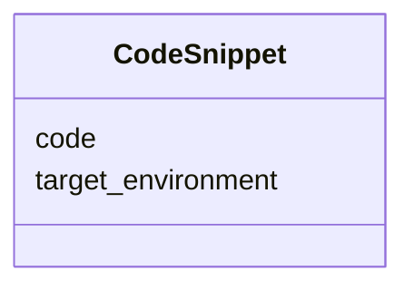

---
search:
  boost: 10.0
---

# Class: CodeSnippet


_A concrete piece of code or expression implementing logic (e.g., validation, generation) in a specific environment._


<div data-search-exclude markdown="1">


URI: [sdt:CodeSnippet](https://w3id.org/dartfx/semanticdt/CodeSnippet)





<!-- no inheritance hierarchy -->

## Slots

| Name | Cardinality and Range | Description | Inheritance |
| ---  | --- | --- | --- |
| [target_environment](target_environment.md) | 1 <br/> [String](String.md) | Target platform, framework, database, or language | direct |
| [code](code.md) | 1 <br/> [String](String.md) | The actual code snippet or expression (e | direct |


## Usages

| used by | used in | type | used |
| ---  | --- | --- | --- |
| [ValidationRule](ValidationRule.md) | [code_snippets](code_snippets.md) | range | [CodeSnippet](CodeSnippet.md) |
| [GenerationRule](GenerationRule.md) | [code_snippets](code_snippets.md) | range | [CodeSnippet](CodeSnippet.md) |


## Identifier and Mapping Information


### Schema Source


* from schema: https://w3id.org/dartfx/semanticdt


## Mappings

| Mapping Type | Mapped Value |
| ---  | ---  |
| self | sdt:CodeSnippet |
| native | sdt:CodeSnippet |


## LinkML Source

<!-- TODO: investigate https://stackoverflow.com/questions/37606292/how-to-create-tabbed-code-blocks-in-mkdocs-or-sphinx -->

### Direct

<details>
```yaml
name: CodeSnippet
description: A concrete piece of code or expression implementing logic (e.g., validation,
  generation) in a specific environment.
from_schema: https://w3id.org/dartfx/semanticdt
slots:
- target_environment
attributes:
  code:
    name: code
    description: The actual code snippet or expression (e.g., Python function/lambda,
      SQL expression).
    from_schema: https://w3id.org/dartfx/semanticdt
    rank: 1000
    domain_of:
    - CodeSnippet
    required: true

```
</details>

### Induced

<details>
```yaml
name: CodeSnippet
description: A concrete piece of code or expression implementing logic (e.g., validation,
  generation) in a specific environment.
from_schema: https://w3id.org/dartfx/semanticdt
attributes:
  code:
    name: code
    description: The actual code snippet or expression (e.g., Python function/lambda,
      SQL expression).
    from_schema: https://w3id.org/dartfx/semanticdt
    rank: 1000
    owner: CodeSnippet
    domain_of:
    - CodeSnippet
    range: string
    required: true
  target_environment:
    name: target_environment
    description: Target platform, framework, database, or language. Prefer using values
      from the TargetEnvironmentEnum controlled vocabulary where applicable. Custom
      values not in the enum are permitted since this slot is of type string.
    from_schema: https://w3id.org/dartfx/semanticdt
    rank: 1000
    owner: CodeSnippet
    domain_of:
    - StorageType
    - CodeSnippet
    range: string
    required: true

```
</details></div>
