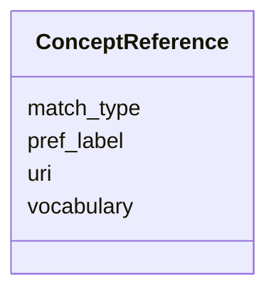

---
search:
  boost: 10.0
---

# Class: ConceptReference


_Reference to a concept in an external ontology or vocabulary._


<div data-search-exclude markdown="1">


URI: [sdt:ConceptReference](https://w3id.org/dartfx/semanticdt/ConceptReference)





<!-- no inheritance hierarchy -->

## Slots

| Name | Cardinality and Range | Description | Inheritance |
| ---  | --- | --- | --- |
| [uri](uri.md) | 1 <br/> [String](String.md) | URI of the concept (e | direct |
| [vocabulary](vocabulary.md) | 0..1 <br/> [String](String.md) | Name of the vocabulary or ontology (e | direct |
| [pref_label](pref_label.md) | 0..1 <br/> [String](String.md) | Preferred label of the concept in the ontology | direct |
| [match_type](match_type.md) | 0..1 <br/> [String](String.md) | Relationship to the concept (e | direct |


## Usages

| used by | used in | type | used |
| ---  | --- | --- | --- |
| [SemanticDataType](SemanticDataType.md) | [concepts](concepts.md) | range | [ConceptReference](ConceptReference.md) |


## Identifier and Mapping Information


### Schema Source


* from schema: https://w3id.org/dartfx/semanticdt


## Mappings

| Mapping Type | Mapped Value |
| ---  | ---  |
| self | sdt:ConceptReference |
| native | sdt:ConceptReference |


## LinkML Source

<!-- TODO: investigate https://stackoverflow.com/questions/37606292/how-to-create-tabbed-code-blocks-in-mkdocs-or-sphinx -->

### Direct

<details>
```yaml
name: ConceptReference
description: Reference to a concept in an external ontology or vocabulary.
from_schema: https://w3id.org/dartfx/semanticdt
attributes:
  uri:
    name: uri
    description: URI of the concept (e.g., SKOS URI).
    from_schema: https://w3id.org/dartfx/semanticdt
    rank: 1000
    domain_of:
    - ConceptReference
    - ClassificationSystem
    required: true
  vocabulary:
    name: vocabulary
    description: Name of the vocabulary or ontology (e.g., SKOS, DDI-CDI, Wikidata,
      LCSH).
    from_schema: https://w3id.org/dartfx/semanticdt
    rank: 1000
    domain_of:
    - ConceptReference
  pref_label:
    name: pref_label
    description: Preferred label of the concept in the ontology.
    from_schema: https://w3id.org/dartfx/semanticdt
    rank: 1000
    domain_of:
    - ConceptReference
  match_type:
    name: match_type
    description: Relationship to the concept (e.g., exactMatch, closeMatch, broadMatch,
      narrowMatch).
    from_schema: https://w3id.org/dartfx/semanticdt
    rank: 1000
    ifabsent: string(exactMatch)
    domain_of:
    - ConceptReference

```
</details>

### Induced

<details>
```yaml
name: ConceptReference
description: Reference to a concept in an external ontology or vocabulary.
from_schema: https://w3id.org/dartfx/semanticdt
attributes:
  uri:
    name: uri
    description: URI of the concept (e.g., SKOS URI).
    from_schema: https://w3id.org/dartfx/semanticdt
    rank: 1000
    owner: ConceptReference
    domain_of:
    - ConceptReference
    - ClassificationSystem
    range: string
    required: true
  vocabulary:
    name: vocabulary
    description: Name of the vocabulary or ontology (e.g., SKOS, DDI-CDI, Wikidata,
      LCSH).
    from_schema: https://w3id.org/dartfx/semanticdt
    rank: 1000
    owner: ConceptReference
    domain_of:
    - ConceptReference
    range: string
  pref_label:
    name: pref_label
    description: Preferred label of the concept in the ontology.
    from_schema: https://w3id.org/dartfx/semanticdt
    rank: 1000
    owner: ConceptReference
    domain_of:
    - ConceptReference
    range: string
  match_type:
    name: match_type
    description: Relationship to the concept (e.g., exactMatch, closeMatch, broadMatch,
      narrowMatch).
    from_schema: https://w3id.org/dartfx/semanticdt
    rank: 1000
    ifabsent: string(exactMatch)
    owner: ConceptReference
    domain_of:
    - ConceptReference
    range: string

```
</details></div>
