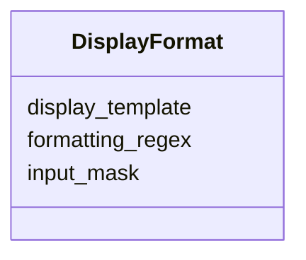

---
search:
  boost: 10.0
---

# Class: DisplayFormat


_Guidelines for displaying and masking data._


<div data-search-exclude markdown="1">


URI: [sdt:DisplayFormat](https://w3id.org/dartfx/semanticdt/DisplayFormat)





<!-- no inheritance hierarchy -->

## Slots

| Name | Cardinality and Range | Description | Inheritance |
| ---  | --- | --- | --- |
| [input_mask](input_mask.md) | 0..1 <br/> [String](String.md) | Mask for input forms (e | direct |
| [display_template](display_template.md) | 0..1 <br/> [String](String.md) | Output representation template | direct |
| [formatting_regex](formatting_regex.md) | 0..1 <br/> [String](String.md) | Regex used to transform raw data to formatted data | direct |


## Usages

| used by | used in | type | used |
| ---  | --- | --- | --- |
| [SemanticDataType](SemanticDataType.md) | [display_format](display_format.md) | range | [DisplayFormat](DisplayFormat.md) |


## Identifier and Mapping Information


### Schema Source


* from schema: https://w3id.org/dartfx/semanticdt


## Mappings

| Mapping Type | Mapped Value |
| ---  | ---  |
| self | sdt:DisplayFormat |
| native | sdt:DisplayFormat |


## LinkML Source

<!-- TODO: investigate https://stackoverflow.com/questions/37606292/how-to-create-tabbed-code-blocks-in-mkdocs-or-sphinx -->

### Direct

<details>
```yaml
name: DisplayFormat
description: Guidelines for displaying and masking data.
from_schema: https://w3id.org/dartfx/semanticdt
attributes:
  input_mask:
    name: input_mask
    description: Mask for input forms (e.g., 999-99-9999).
    from_schema: https://w3id.org/dartfx/semanticdt
    rank: 1000
    domain_of:
    - DisplayFormat
  display_template:
    name: display_template
    description: Output representation template.
    from_schema: https://w3id.org/dartfx/semanticdt
    rank: 1000
    domain_of:
    - DisplayFormat
  formatting_regex:
    name: formatting_regex
    description: Regex used to transform raw data to formatted data.
    from_schema: https://w3id.org/dartfx/semanticdt
    rank: 1000
    domain_of:
    - DisplayFormat

```
</details>

### Induced

<details>
```yaml
name: DisplayFormat
description: Guidelines for displaying and masking data.
from_schema: https://w3id.org/dartfx/semanticdt
attributes:
  input_mask:
    name: input_mask
    description: Mask for input forms (e.g., 999-99-9999).
    from_schema: https://w3id.org/dartfx/semanticdt
    rank: 1000
    owner: DisplayFormat
    domain_of:
    - DisplayFormat
    range: string
  display_template:
    name: display_template
    description: Output representation template.
    from_schema: https://w3id.org/dartfx/semanticdt
    rank: 1000
    owner: DisplayFormat
    domain_of:
    - DisplayFormat
    range: string
  formatting_regex:
    name: formatting_regex
    description: Regex used to transform raw data to formatted data.
    from_schema: https://w3id.org/dartfx/semanticdt
    rank: 1000
    owner: DisplayFormat
    domain_of:
    - DisplayFormat
    range: string

```
</details></div>
