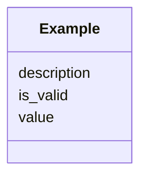

---
search:
  boost: 10.0
---

# Class: Example


_Concrete instance of values._


<div data-search-exclude markdown="1">


URI: [sdt:Example](https://w3id.org/dartfx/semanticdt/Example)





<!-- no inheritance hierarchy -->

## Slots

| Name | Cardinality and Range | Description | Inheritance |
| ---  | --- | --- | --- |
| [value](value.md) | 1 <br/> [String](String.md) | Example value representation | direct |
| [is_valid](is_valid.md) | 1 <br/> [Boolean](Boolean.md) | Indication of whether the example value is valid under the SDT | direct |
| [description](description.md) | 0..1 <br/> [String](String.md) | Description of the specific test case this example represents | direct |


## Usages

| used by | used in | type | used |
| ---  | --- | --- | --- |
| [SemanticDataType](SemanticDataType.md) | [examples](examples.md) | range | [Example](Example.md) |


## Identifier and Mapping Information


### Schema Source


* from schema: https://w3id.org/dartfx/semanticdt


## Mappings

| Mapping Type | Mapped Value |
| ---  | ---  |
| self | sdt:Example |
| native | sdt:Example |


## LinkML Source

<!-- TODO: investigate https://stackoverflow.com/questions/37606292/how-to-create-tabbed-code-blocks-in-mkdocs-or-sphinx -->

### Direct

<details>
```yaml
name: Example
description: Concrete instance of values.
from_schema: https://w3id.org/dartfx/semanticdt
attributes:
  value:
    name: value
    description: Example value representation.
    from_schema: https://w3id.org/dartfx/semanticdt
    rank: 1000
    domain_of:
    - Example
    required: true
  is_valid:
    name: is_valid
    description: Indication of whether the example value is valid under the SDT.
    from_schema: https://w3id.org/dartfx/semanticdt
    rank: 1000
    domain_of:
    - Example
    range: boolean
    required: true
  description:
    name: description
    description: Description of the specific test case this example represents.
    from_schema: https://w3id.org/dartfx/semanticdt
    domain_of:
    - SemanticDataType
    - AgentSkill
    - GeospatialCoverage
    - TemporalCoverage
    - Example
    - Resource

```
</details>

### Induced

<details>
```yaml
name: Example
description: Concrete instance of values.
from_schema: https://w3id.org/dartfx/semanticdt
attributes:
  value:
    name: value
    description: Example value representation.
    from_schema: https://w3id.org/dartfx/semanticdt
    rank: 1000
    owner: Example
    domain_of:
    - Example
    range: string
    required: true
  is_valid:
    name: is_valid
    description: Indication of whether the example value is valid under the SDT.
    from_schema: https://w3id.org/dartfx/semanticdt
    rank: 1000
    owner: Example
    domain_of:
    - Example
    range: boolean
    required: true
  description:
    name: description
    description: Description of the specific test case this example represents.
    from_schema: https://w3id.org/dartfx/semanticdt
    owner: Example
    domain_of:
    - SemanticDataType
    - AgentSkill
    - GeospatialCoverage
    - TemporalCoverage
    - Example
    - Resource
    range: string

```
</details></div>
