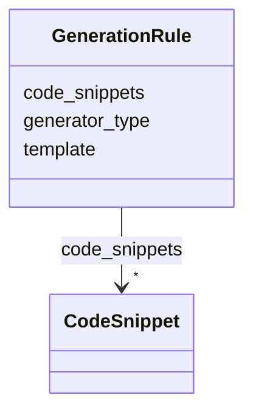

---
search:
  boost: 10.0
---

# Class: GenerationRule


_Directive for synthetic data generation._


<div data-search-exclude markdown="1">


URI: [sdt:GenerationRule](https://w3id.org/dartfx/semanticdt/GenerationRule)





<!-- no inheritance hierarchy -->

## Slots

| Name | Cardinality and Range | Description | Inheritance |
| ---  | --- | --- | --- |
| [generator_type](generator_type.md) | 1 <br/> [String](String.md) | Type of generator (e | direct |
| [template](template.md) | 0..1 <br/> [String](String.md) | Seed template or expression | direct |
| [code_snippets](code_snippets.md) | * <br/> [CodeSnippet](CodeSnippet.md) | Environment-specific code snippets or expressions implementing the generator ... | direct |


## Usages

| used by | used in | type | used |
| ---  | --- | --- | --- |
| [SemanticDataType](SemanticDataType.md) | [generation_rules](generation_rules.md) | range | [GenerationRule](GenerationRule.md) |


## Identifier and Mapping Information


### Schema Source


* from schema: https://w3id.org/dartfx/semanticdt


## Mappings

| Mapping Type | Mapped Value |
| ---  | ---  |
| self | sdt:GenerationRule |
| native | sdt:GenerationRule |


## LinkML Source

<!-- TODO: investigate https://stackoverflow.com/questions/37606292/how-to-create-tabbed-code-blocks-in-mkdocs-or-sphinx -->

### Direct

<details>
```yaml
name: GenerationRule
description: Directive for synthetic data generation.
from_schema: https://w3id.org/dartfx/semanticdt
attributes:
  generator_type:
    name: generator_type
    description: Type of generator (e.g., regex_fuzzer, template, faker_provider,
      custom).
    from_schema: https://w3id.org/dartfx/semanticdt
    rank: 1000
    domain_of:
    - GenerationRule
    required: true
  template:
    name: template
    description: Seed template or expression.
    from_schema: https://w3id.org/dartfx/semanticdt
    rank: 1000
    domain_of:
    - GenerationRule
  code_snippets:
    name: code_snippets
    description: Environment-specific code snippets or expressions implementing the
      generator logic.
    from_schema: https://w3id.org/dartfx/semanticdt
    domain_of:
    - ValidationRule
    - GenerationRule
    range: CodeSnippet
    multivalued: true

```
</details>

### Induced

<details>
```yaml
name: GenerationRule
description: Directive for synthetic data generation.
from_schema: https://w3id.org/dartfx/semanticdt
attributes:
  generator_type:
    name: generator_type
    description: Type of generator (e.g., regex_fuzzer, template, faker_provider,
      custom).
    from_schema: https://w3id.org/dartfx/semanticdt
    rank: 1000
    owner: GenerationRule
    domain_of:
    - GenerationRule
    range: string
    required: true
  template:
    name: template
    description: Seed template or expression.
    from_schema: https://w3id.org/dartfx/semanticdt
    rank: 1000
    owner: GenerationRule
    domain_of:
    - GenerationRule
    range: string
  code_snippets:
    name: code_snippets
    description: Environment-specific code snippets or expressions implementing the
      generator logic.
    from_schema: https://w3id.org/dartfx/semanticdt
    owner: GenerationRule
    domain_of:
    - ValidationRule
    - GenerationRule
    range: CodeSnippet
    multivalued: true

```
</details></div>
