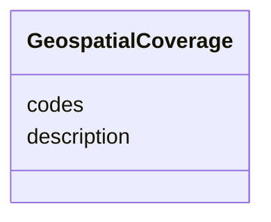

---
search:
  boost: 10.0
---

# Class: GeospatialCoverage


_Geospatial coverage boundaries represented by description and/or formal codes or URIs._


<div data-search-exclude markdown="1">


URI: [sdt:GeospatialCoverage](https://w3id.org/dartfx/semanticdt/GeospatialCoverage)





<!-- no inheritance hierarchy -->

## Slots

| Name | Cardinality and Range | Description | Inheritance |
| ---  | --- | --- | --- |
| [description](description.md) | 0..1 <br/> [String](String.md) | Human-readable description of the geospatial coverage (e | direct |
| [codes](codes.md) | * <br/> [String](String.md) | A list of formal codes or URIs (e | direct |


## Usages

| used by | used in | type | used |
| ---  | --- | --- | --- |
| [ScopeContext](ScopeContext.md) | [geospatial_coverage](geospatial_coverage.md) | range | [GeospatialCoverage](GeospatialCoverage.md) |


## Identifier and Mapping Information


### Schema Source


* from schema: https://w3id.org/dartfx/semanticdt


## Mappings

| Mapping Type | Mapped Value |
| ---  | ---  |
| self | sdt:GeospatialCoverage |
| native | sdt:GeospatialCoverage |


## LinkML Source

<!-- TODO: investigate https://stackoverflow.com/questions/37606292/how-to-create-tabbed-code-blocks-in-mkdocs-or-sphinx -->

### Direct

<details>
```yaml
name: GeospatialCoverage
description: Geospatial coverage boundaries represented by description and/or formal
  codes or URIs.
from_schema: https://w3id.org/dartfx/semanticdt
attributes:
  description:
    name: description
    description: Human-readable description of the geospatial coverage (e.g., United
      States, Canada, Global).
    from_schema: https://w3id.org/dartfx/semanticdt
    domain_of:
    - SemanticDataType
    - AgentSkill
    - GeospatialCoverage
    - TemporalCoverage
    - Example
    - Resource
  codes:
    name: codes
    description: A list of formal codes or URIs (e.g., ISO country/subdivision codes,
      GeoNames URIs, Wikidata URIs).
    from_schema: https://w3id.org/dartfx/semanticdt
    rank: 1000
    domain_of:
    - GeospatialCoverage
    range: string
    multivalued: true

```
</details>

### Induced

<details>
```yaml
name: GeospatialCoverage
description: Geospatial coverage boundaries represented by description and/or formal
  codes or URIs.
from_schema: https://w3id.org/dartfx/semanticdt
attributes:
  description:
    name: description
    description: Human-readable description of the geospatial coverage (e.g., United
      States, Canada, Global).
    from_schema: https://w3id.org/dartfx/semanticdt
    owner: GeospatialCoverage
    domain_of:
    - SemanticDataType
    - AgentSkill
    - GeospatialCoverage
    - TemporalCoverage
    - Example
    - Resource
    range: string
  codes:
    name: codes
    description: A list of formal codes or URIs (e.g., ISO country/subdivision codes,
      GeoNames URIs, Wikidata URIs).
    from_schema: https://w3id.org/dartfx/semanticdt
    rank: 1000
    owner: GeospatialCoverage
    domain_of:
    - GeospatialCoverage
    range: string
    multivalued: true

```
</details></div>
