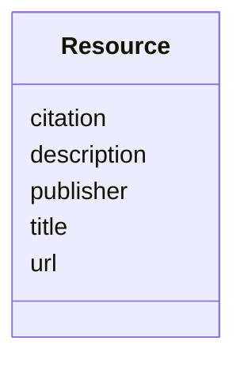

---
search:
  boost: 10.0
---

# Class: Resource


_An external resource, citation, or reference related to the Semantic Data Type (using simple Dublin Core elements)._


<div data-search-exclude markdown="1">


URI: [sdt:Resource](https://w3id.org/dartfx/semanticdt/Resource)





<!-- no inheritance hierarchy -->

## Slots

| Name | Cardinality and Range | Description | Inheritance |
| ---  | --- | --- | --- |
| [url](url.md) | 1 <br/> [String](String.md) | The URL/URI of the resource | direct |
| [title](title.md) | 0..1 <br/> [String](String.md) | Human-readable name of the resource | direct |
| [description](description.md) | 0..1 <br/> [String](String.md) | A brief summary or account of the resource | direct |
| [citation](citation.md) | 0..1 <br/> [String](String.md) | A formal bibliographic citation for the resource | direct |
| [publisher](publisher.md) | 0..1 <br/> [String](String.md) | The entity or publisher responsible for making the resource available | direct |


## Usages

| used by | used in | type | used |
| ---  | --- | --- | --- |
| [SemanticDataType](SemanticDataType.md) | [resources](resources.md) | range | [Resource](Resource.md) |


## Identifier and Mapping Information


### Schema Source


* from schema: https://w3id.org/dartfx/semanticdt


## Mappings

| Mapping Type | Mapped Value |
| ---  | ---  |
| self | sdt:Resource |
| native | sdt:Resource |


## LinkML Source

<!-- TODO: investigate https://stackoverflow.com/questions/37606292/how-to-create-tabbed-code-blocks-in-mkdocs-or-sphinx -->

### Direct

<details>
```yaml
name: Resource
description: An external resource, citation, or reference related to the Semantic
  Data Type (using simple Dublin Core elements).
from_schema: https://w3id.org/dartfx/semanticdt
attributes:
  url:
    name: url
    description: The URL/URI of the resource.
    from_schema: https://w3id.org/dartfx/semanticdt
    rank: 1000
    domain_of:
    - Resource
    required: true
  title:
    name: title
    description: Human-readable name of the resource.
    from_schema: https://w3id.org/dartfx/semanticdt
    rank: 1000
    domain_of:
    - Resource
  description:
    name: description
    description: A brief summary or account of the resource.
    from_schema: https://w3id.org/dartfx/semanticdt
    domain_of:
    - SemanticDataType
    - AgentSkill
    - GeospatialCoverage
    - TemporalCoverage
    - Example
    - Resource
  citation:
    name: citation
    description: A formal bibliographic citation for the resource.
    from_schema: https://w3id.org/dartfx/semanticdt
    rank: 1000
    domain_of:
    - Resource
  publisher:
    name: publisher
    description: The entity or publisher responsible for making the resource available.
    from_schema: https://w3id.org/dartfx/semanticdt
    rank: 1000
    domain_of:
    - Resource

```
</details>

### Induced

<details>
```yaml
name: Resource
description: An external resource, citation, or reference related to the Semantic
  Data Type (using simple Dublin Core elements).
from_schema: https://w3id.org/dartfx/semanticdt
attributes:
  url:
    name: url
    description: The URL/URI of the resource.
    from_schema: https://w3id.org/dartfx/semanticdt
    rank: 1000
    owner: Resource
    domain_of:
    - Resource
    range: string
    required: true
  title:
    name: title
    description: Human-readable name of the resource.
    from_schema: https://w3id.org/dartfx/semanticdt
    rank: 1000
    owner: Resource
    domain_of:
    - Resource
    range: string
  description:
    name: description
    description: A brief summary or account of the resource.
    from_schema: https://w3id.org/dartfx/semanticdt
    owner: Resource
    domain_of:
    - SemanticDataType
    - AgentSkill
    - GeospatialCoverage
    - TemporalCoverage
    - Example
    - Resource
    range: string
  citation:
    name: citation
    description: A formal bibliographic citation for the resource.
    from_schema: https://w3id.org/dartfx/semanticdt
    rank: 1000
    owner: Resource
    domain_of:
    - Resource
    range: string
  publisher:
    name: publisher
    description: The entity or publisher responsible for making the resource available.
    from_schema: https://w3id.org/dartfx/semanticdt
    rank: 1000
    owner: Resource
    domain_of:
    - Resource
    range: string

```
</details></div>
