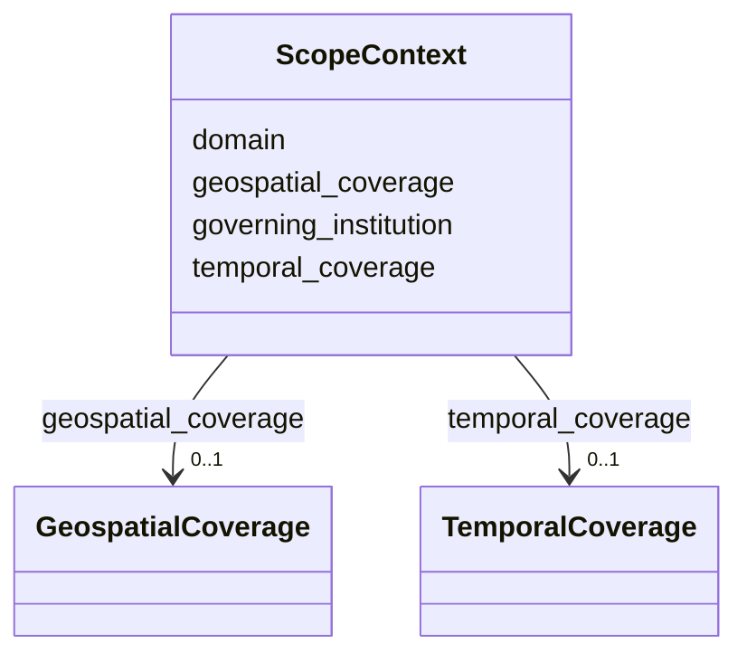

---
search:
  boost: 10.0
---

# Class: ScopeContext


_Contextual boundaries of the data type._


<div data-search-exclude markdown="1">


URI: [sdt:ScopeContext](https://w3id.org/dartfx/semanticdt/ScopeContext)





<!-- no inheritance hierarchy -->

## Slots

| Name | Cardinality and Range | Description | Inheritance |
| ---  | --- | --- | --- |
| [geospatial_coverage](geospatial_coverage.md) | 0..1 <br/> [GeospatialCoverage](GeospatialCoverage.md) | Geospatial region or country coverage details | direct |
| [temporal_coverage](temporal_coverage.md) | 0..1 <br/> [TemporalCoverage](TemporalCoverage.md) | Temporal coverage details | direct |
| [domain](domain.md) | 0..1 <br/> [String](String.md) | Specific field or subject domain (e | direct |
| [governing_institution](governing_institution.md) | 0..1 <br/> [String](String.md) | Governing body (e | direct |


## Usages

| used by | used in | type | used |
| ---  | --- | --- | --- |
| [SemanticDataType](SemanticDataType.md) | [scope](scope.md) | range | [ScopeContext](ScopeContext.md) |


## Identifier and Mapping Information


### Schema Source


* from schema: https://w3id.org/dartfx/semanticdt


## Mappings

| Mapping Type | Mapped Value |
| ---  | ---  |
| self | sdt:ScopeContext |
| native | sdt:ScopeContext |


## LinkML Source

<!-- TODO: investigate https://stackoverflow.com/questions/37606292/how-to-create-tabbed-code-blocks-in-mkdocs-or-sphinx -->

### Direct

<details>
```yaml
name: ScopeContext
description: Contextual boundaries of the data type.
from_schema: https://w3id.org/dartfx/semanticdt
attributes:
  geospatial_coverage:
    name: geospatial_coverage
    description: Geospatial region or country coverage details.
    from_schema: https://w3id.org/dartfx/semanticdt
    rank: 1000
    domain_of:
    - ScopeContext
    range: GeospatialCoverage
  temporal_coverage:
    name: temporal_coverage
    description: Temporal coverage details.
    from_schema: https://w3id.org/dartfx/semanticdt
    rank: 1000
    domain_of:
    - ScopeContext
    range: TemporalCoverage
  domain:
    name: domain
    description: Specific field or subject domain (e.g., Healthcare, Finance).
    from_schema: https://w3id.org/dartfx/semanticdt
    rank: 1000
    domain_of:
    - ScopeContext
  governing_institution:
    name: governing_institution
    description: Governing body (e.g., ISO, W3C, IRS).
    from_schema: https://w3id.org/dartfx/semanticdt
    rank: 1000
    domain_of:
    - ScopeContext

```
</details>

### Induced

<details>
```yaml
name: ScopeContext
description: Contextual boundaries of the data type.
from_schema: https://w3id.org/dartfx/semanticdt
attributes:
  geospatial_coverage:
    name: geospatial_coverage
    description: Geospatial region or country coverage details.
    from_schema: https://w3id.org/dartfx/semanticdt
    rank: 1000
    owner: ScopeContext
    domain_of:
    - ScopeContext
    range: GeospatialCoverage
  temporal_coverage:
    name: temporal_coverage
    description: Temporal coverage details.
    from_schema: https://w3id.org/dartfx/semanticdt
    rank: 1000
    owner: ScopeContext
    domain_of:
    - ScopeContext
    range: TemporalCoverage
  domain:
    name: domain
    description: Specific field or subject domain (e.g., Healthcare, Finance).
    from_schema: https://w3id.org/dartfx/semanticdt
    rank: 1000
    owner: ScopeContext
    domain_of:
    - ScopeContext
    range: string
  governing_institution:
    name: governing_institution
    description: Governing body (e.g., ISO, W3C, IRS).
    from_schema: https://w3id.org/dartfx/semanticdt
    rank: 1000
    owner: ScopeContext
    domain_of:
    - ScopeContext
    range: string

```
</details></div>
