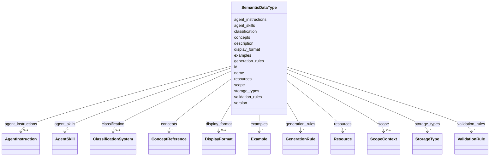

---
search:
  boost: 10.0
---

# Class: SemanticDataType


_A high-level data type associated with a distinct concept, validation/generation rules, and metadata._


<div data-search-exclude markdown="1">


URI: [sdt:SemanticDataType](https://w3id.org/dartfx/semanticdt/SemanticDataType)





<!-- no inheritance hierarchy -->

## Slots

| Name | Cardinality and Range | Description | Inheritance |
| ---  | --- | --- | --- |
| [id](id.md) | 1 <br/> [String](String.md) | Unique identifier/URI for the Semantic Data Type | direct |
| [name](name.md) | 1 <br/> [String](String.md) | Human-readable name of the Semantic Data Type | direct |
| [description](description.md) | 1 <br/> [String](String.md) | A human-readable description of the Semantic Data Type | direct |
| [version](version.md) | 1 <br/> [String](String.md) | The version of the Semantic Data Type instance definition (e | direct |
| [concepts](concepts.md) | * <br/> [ConceptReference](ConceptReference.md) | A list of conceptual ontology alignments or mapping references representing t... | direct |
| [storage_types](storage_types.md) | * <br/> [StorageType](StorageType.md) | Mappings to physical storage types across different environments | direct |
| [classification](classification.md) | 0..1 <br/> [ClassificationSystem](ClassificationSystem.md) | Code lists or classification schemes that categorize this variable | direct |
| [validation_rules](validation_rules.md) | * <br/> [ValidationRule](ValidationRule.md) | Rules to validate physical representations of the data type | direct |
| [generation_rules](generation_rules.md) | * <br/> [GenerationRule](GenerationRule.md) | Templates or directives for generating synthetic valid data | direct |
| [agent_instructions](agent_instructions.md) | 0..1 <br/> [AgentInstruction](AgentInstruction.md) | Specific guidelines and instructions for AI agents handling this data type | direct |
| [agent_skills](agent_skills.md) | * <br/> [AgentSkill](AgentSkill.md) | Tools, functions, or prompts associated with this data type | direct |
| [scope](scope.md) | 0..1 <br/> [ScopeContext](ScopeContext.md) | Contextual scope of the data type (temporal, geographic, etc | direct |
| [display_format](display_format.md) | 0..1 <br/> [DisplayFormat](DisplayFormat.md) | Formatting rules for displaying values of this type | direct |
| [examples](examples.md) | * <br/> [Example](Example.md) | Curated valid and invalid examples for documentation and testing | direct |
| [resources](resources.md) | * <br/> [Resource](Resource.md) | External resources and references related to the Semantic Data Type | direct |


## Identifier and Mapping Information


### Schema Source


* from schema: https://w3id.org/dartfx/semanticdt


## Mappings

| Mapping Type | Mapped Value |
| ---  | ---  |
| self | sdt:SemanticDataType |
| native | sdt:SemanticDataType |


## LinkML Source

<!-- TODO: investigate https://stackoverflow.com/questions/37606292/how-to-create-tabbed-code-blocks-in-mkdocs-or-sphinx -->

### Direct

<details>
```yaml
name: SemanticDataType
description: A high-level data type associated with a distinct concept, validation/generation
  rules, and metadata.
from_schema: https://w3id.org/dartfx/semanticdt
attributes:
  id:
    name: id
    description: Unique identifier/URI for the Semantic Data Type.
    from_schema: https://w3id.org/dartfx/semanticdt
    rank: 1000
    identifier: true
    domain_of:
    - SemanticDataType
    required: true
  name:
    name: name
    description: Human-readable name of the Semantic Data Type.
    from_schema: https://w3id.org/dartfx/semanticdt
    rank: 1000
    domain_of:
    - SemanticDataType
    - ClassificationSystem
    required: true
  description:
    name: description
    description: A human-readable description of the Semantic Data Type.
    from_schema: https://w3id.org/dartfx/semanticdt
    rank: 1000
    domain_of:
    - SemanticDataType
    - AgentSkill
    - GeospatialCoverage
    - TemporalCoverage
    - Example
    - Resource
    required: true
  version:
    name: version
    description: The version of the Semantic Data Type instance definition (e.g.,
      1.0.0).
    from_schema: https://w3id.org/dartfx/semanticdt
    rank: 1000
    domain_of:
    - SemanticDataType
    - ClassificationSystem
    required: true
  concepts:
    name: concepts
    description: A list of conceptual ontology alignments or mapping references representing
      this data type in external systems (e.g., SKOS concepts, Wikidata items, or
      vocabularies like DDI-CDI and schema.org). This should list multiple representations
      of the same underlying semantic concept, not distinct concepts.
    from_schema: https://w3id.org/dartfx/semanticdt
    rank: 1000
    domain_of:
    - SemanticDataType
    range: ConceptReference
    multivalued: true
  storage_types:
    name: storage_types
    description: Mappings to physical storage types across different environments.
      A mapping for the 'generic' environment is required to define the platform-independent
      base type.
    from_schema: https://w3id.org/dartfx/semanticdt
    rank: 1000
    domain_of:
    - SemanticDataType
    range: StorageType
    multivalued: true
  classification:
    name: classification
    description: Code lists or classification schemes that categorize this variable.
    from_schema: https://w3id.org/dartfx/semanticdt
    rank: 1000
    domain_of:
    - SemanticDataType
    range: ClassificationSystem
  validation_rules:
    name: validation_rules
    description: Rules to validate physical representations of the data type.
    from_schema: https://w3id.org/dartfx/semanticdt
    rank: 1000
    domain_of:
    - SemanticDataType
    range: ValidationRule
    multivalued: true
  generation_rules:
    name: generation_rules
    description: Templates or directives for generating synthetic valid data.
    from_schema: https://w3id.org/dartfx/semanticdt
    rank: 1000
    domain_of:
    - SemanticDataType
    range: GenerationRule
    multivalued: true
  agent_instructions:
    name: agent_instructions
    description: Specific guidelines and instructions for AI agents handling this
      data type.
    from_schema: https://w3id.org/dartfx/semanticdt
    rank: 1000
    domain_of:
    - SemanticDataType
    range: AgentInstruction
  agent_skills:
    name: agent_skills
    description: Tools, functions, or prompts associated with this data type.
    from_schema: https://w3id.org/dartfx/semanticdt
    rank: 1000
    domain_of:
    - SemanticDataType
    range: AgentSkill
    multivalued: true
  scope:
    name: scope
    description: Contextual scope of the data type (temporal, geographic, etc.).
    from_schema: https://w3id.org/dartfx/semanticdt
    rank: 1000
    domain_of:
    - SemanticDataType
    range: ScopeContext
  display_format:
    name: display_format
    description: Formatting rules for displaying values of this type.
    from_schema: https://w3id.org/dartfx/semanticdt
    rank: 1000
    domain_of:
    - SemanticDataType
    range: DisplayFormat
  examples:
    name: examples
    description: Curated valid and invalid examples for documentation and testing.
    from_schema: https://w3id.org/dartfx/semanticdt
    rank: 1000
    domain_of:
    - SemanticDataType
    range: Example
    multivalued: true
  resources:
    name: resources
    description: External resources and references related to the Semantic Data Type.
    from_schema: https://w3id.org/dartfx/semanticdt
    rank: 1000
    domain_of:
    - SemanticDataType
    range: Resource
    multivalued: true

```
</details>

### Induced

<details>
```yaml
name: SemanticDataType
description: A high-level data type associated with a distinct concept, validation/generation
  rules, and metadata.
from_schema: https://w3id.org/dartfx/semanticdt
attributes:
  id:
    name: id
    description: Unique identifier/URI for the Semantic Data Type.
    from_schema: https://w3id.org/dartfx/semanticdt
    rank: 1000
    identifier: true
    owner: SemanticDataType
    domain_of:
    - SemanticDataType
    range: string
    required: true
  name:
    name: name
    description: Human-readable name of the Semantic Data Type.
    from_schema: https://w3id.org/dartfx/semanticdt
    rank: 1000
    owner: SemanticDataType
    domain_of:
    - SemanticDataType
    - ClassificationSystem
    range: string
    required: true
  description:
    name: description
    description: A human-readable description of the Semantic Data Type.
    from_schema: https://w3id.org/dartfx/semanticdt
    rank: 1000
    owner: SemanticDataType
    domain_of:
    - SemanticDataType
    - AgentSkill
    - GeospatialCoverage
    - TemporalCoverage
    - Example
    - Resource
    range: string
    required: true
  version:
    name: version
    description: The version of the Semantic Data Type instance definition (e.g.,
      1.0.0).
    from_schema: https://w3id.org/dartfx/semanticdt
    rank: 1000
    owner: SemanticDataType
    domain_of:
    - SemanticDataType
    - ClassificationSystem
    range: string
    required: true
  concepts:
    name: concepts
    description: A list of conceptual ontology alignments or mapping references representing
      this data type in external systems (e.g., SKOS concepts, Wikidata items, or
      vocabularies like DDI-CDI and schema.org). This should list multiple representations
      of the same underlying semantic concept, not distinct concepts.
    from_schema: https://w3id.org/dartfx/semanticdt
    rank: 1000
    owner: SemanticDataType
    domain_of:
    - SemanticDataType
    range: ConceptReference
    multivalued: true
  storage_types:
    name: storage_types
    description: Mappings to physical storage types across different environments.
      A mapping for the 'generic' environment is required to define the platform-independent
      base type.
    from_schema: https://w3id.org/dartfx/semanticdt
    rank: 1000
    owner: SemanticDataType
    domain_of:
    - SemanticDataType
    range: StorageType
    multivalued: true
  classification:
    name: classification
    description: Code lists or classification schemes that categorize this variable.
    from_schema: https://w3id.org/dartfx/semanticdt
    rank: 1000
    owner: SemanticDataType
    domain_of:
    - SemanticDataType
    range: ClassificationSystem
  validation_rules:
    name: validation_rules
    description: Rules to validate physical representations of the data type.
    from_schema: https://w3id.org/dartfx/semanticdt
    rank: 1000
    owner: SemanticDataType
    domain_of:
    - SemanticDataType
    range: ValidationRule
    multivalued: true
  generation_rules:
    name: generation_rules
    description: Templates or directives for generating synthetic valid data.
    from_schema: https://w3id.org/dartfx/semanticdt
    rank: 1000
    owner: SemanticDataType
    domain_of:
    - SemanticDataType
    range: GenerationRule
    multivalued: true
  agent_instructions:
    name: agent_instructions
    description: Specific guidelines and instructions for AI agents handling this
      data type.
    from_schema: https://w3id.org/dartfx/semanticdt
    rank: 1000
    owner: SemanticDataType
    domain_of:
    - SemanticDataType
    range: AgentInstruction
  agent_skills:
    name: agent_skills
    description: Tools, functions, or prompts associated with this data type.
    from_schema: https://w3id.org/dartfx/semanticdt
    rank: 1000
    owner: SemanticDataType
    domain_of:
    - SemanticDataType
    range: AgentSkill
    multivalued: true
  scope:
    name: scope
    description: Contextual scope of the data type (temporal, geographic, etc.).
    from_schema: https://w3id.org/dartfx/semanticdt
    rank: 1000
    owner: SemanticDataType
    domain_of:
    - SemanticDataType
    range: ScopeContext
  display_format:
    name: display_format
    description: Formatting rules for displaying values of this type.
    from_schema: https://w3id.org/dartfx/semanticdt
    rank: 1000
    owner: SemanticDataType
    domain_of:
    - SemanticDataType
    range: DisplayFormat
  examples:
    name: examples
    description: Curated valid and invalid examples for documentation and testing.
    from_schema: https://w3id.org/dartfx/semanticdt
    rank: 1000
    owner: SemanticDataType
    domain_of:
    - SemanticDataType
    range: Example
    multivalued: true
  resources:
    name: resources
    description: External resources and references related to the Semantic Data Type.
    from_schema: https://w3id.org/dartfx/semanticdt
    rank: 1000
    owner: SemanticDataType
    domain_of:
    - SemanticDataType
    range: Resource
    multivalued: true

```
</details></div>
