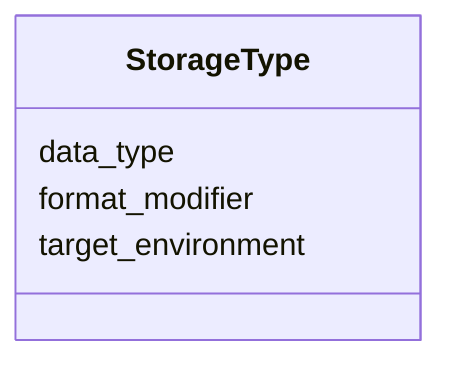

---
search:
  boost: 10.0
---

# Class: StorageType


_Physical or logical storage data type binding._


<div data-search-exclude markdown="1">


URI: [sdt:StorageType](https://w3id.org/dartfx/semanticdt/StorageType)





<!-- no inheritance hierarchy -->

## Slots

| Name | Cardinality and Range | Description | Inheritance |
| ---  | --- | --- | --- |
| [target_environment](target_environment.md) | 1 <br/> [String](String.md) | Target platform, framework, database, or language | direct |
| [data_type](data_type.md) | 1 <br/> [String](String.md) | Data type identifier in the target environment (e | direct |
| [format_modifier](format_modifier.md) | 0..1 <br/> [String](String.md) | Optional modifiers (e | direct |


## Usages

| used by | used in | type | used |
| ---  | --- | --- | --- |
| [SemanticDataType](SemanticDataType.md) | [storage_types](storage_types.md) | range | [StorageType](StorageType.md) |


## Identifier and Mapping Information


### Schema Source


* from schema: https://w3id.org/dartfx/semanticdt


## Mappings

| Mapping Type | Mapped Value |
| ---  | ---  |
| self | sdt:StorageType |
| native | sdt:StorageType |


## LinkML Source

<!-- TODO: investigate https://stackoverflow.com/questions/37606292/how-to-create-tabbed-code-blocks-in-mkdocs-or-sphinx -->

### Direct

<details>
```yaml
name: StorageType
description: Physical or logical storage data type binding.
from_schema: https://w3id.org/dartfx/semanticdt
slots:
- target_environment
attributes:
  data_type:
    name: data_type
    description: Data type identifier in the target environment (e.g., string, varchar,
      integer, str).
    from_schema: https://w3id.org/dartfx/semanticdt
    rank: 1000
    domain_of:
    - StorageType
    required: true
  format_modifier:
    name: format_modifier
    description: Optional modifiers (e.g., length, precision).
    from_schema: https://w3id.org/dartfx/semanticdt
    rank: 1000
    domain_of:
    - StorageType

```
</details>

### Induced

<details>
```yaml
name: StorageType
description: Physical or logical storage data type binding.
from_schema: https://w3id.org/dartfx/semanticdt
attributes:
  data_type:
    name: data_type
    description: Data type identifier in the target environment (e.g., string, varchar,
      integer, str).
    from_schema: https://w3id.org/dartfx/semanticdt
    rank: 1000
    owner: StorageType
    domain_of:
    - StorageType
    range: string
    required: true
  format_modifier:
    name: format_modifier
    description: Optional modifiers (e.g., length, precision).
    from_schema: https://w3id.org/dartfx/semanticdt
    rank: 1000
    owner: StorageType
    domain_of:
    - StorageType
    range: string
  target_environment:
    name: target_environment
    description: Target platform, framework, database, or language. Prefer using values
      from the TargetEnvironmentEnum controlled vocabulary where applicable. Custom
      values not in the enum are permitted since this slot is of type string.
    from_schema: https://w3id.org/dartfx/semanticdt
    rank: 1000
    owner: StorageType
    domain_of:
    - StorageType
    - CodeSnippet
    range: string
    required: true

```
</details></div>
