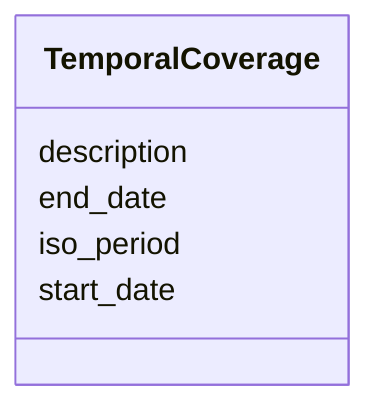

---
search:
  boost: 10.0
---

# Class: TemporalCoverage


_Temporal coverage boundaries represented by description, start/end dates, or ISO 8601 periods/durations._


<div data-search-exclude markdown="1">


URI: [sdt:TemporalCoverage](https://w3id.org/dartfx/semanticdt/TemporalCoverage)





<!-- no inheritance hierarchy -->

## Slots

| Name | Cardinality and Range | Description | Inheritance |
| ---  | --- | --- | --- |
| [description](description.md) | 0..1 <br/> [String](String.md) | Human-readable description of the temporal coverage (e | direct |
| [start_date](start_date.md) | 0..1 <br/> [String](String.md) | Start date of the coverage formatted strictly according to ISO 8601 (YYYY-MM-... | direct |
| [end_date](end_date.md) | 0..1 <br/> [String](String.md) | End date of the coverage formatted strictly according to ISO 8601 (YYYY-MM-DD... | direct |
| [iso_period](iso_period.md) | 0..1 <br/> [String](String.md) | ISO 8601 time interval or period representation (e | direct |


## Usages

| used by | used in | type | used |
| ---  | --- | --- | --- |
| [ScopeContext](ScopeContext.md) | [temporal_coverage](temporal_coverage.md) | range | [TemporalCoverage](TemporalCoverage.md) |


## Identifier and Mapping Information


### Schema Source


* from schema: https://w3id.org/dartfx/semanticdt


## Mappings

| Mapping Type | Mapped Value |
| ---  | ---  |
| self | sdt:TemporalCoverage |
| native | sdt:TemporalCoverage |


## LinkML Source

<!-- TODO: investigate https://stackoverflow.com/questions/37606292/how-to-create-tabbed-code-blocks-in-mkdocs-or-sphinx -->

### Direct

<details>
```yaml
name: TemporalCoverage
description: Temporal coverage boundaries represented by description, start/end dates,
  or ISO 8601 periods/durations.
from_schema: https://w3id.org/dartfx/semanticdt
attributes:
  description:
    name: description
    description: Human-readable description of the temporal coverage (e.g., '21st
      Century', '2020 Census').
    from_schema: https://w3id.org/dartfx/semanticdt
    domain_of:
    - SemanticDataType
    - AgentSkill
    - GeospatialCoverage
    - TemporalCoverage
    - Example
    - Resource
  start_date:
    name: start_date
    description: Start date of the coverage formatted strictly according to ISO 8601
      (YYYY-MM-DD).
    from_schema: https://w3id.org/dartfx/semanticdt
    rank: 1000
    is_a: iso_date
    domain_of:
    - TemporalCoverage
    pattern: ^\d{4}-\d{2}-\d{2}$
  end_date:
    name: end_date
    description: End date of the coverage formatted strictly according to ISO 8601
      (YYYY-MM-DD).
    from_schema: https://w3id.org/dartfx/semanticdt
    rank: 1000
    is_a: iso_date
    domain_of:
    - TemporalCoverage
    pattern: ^\d{4}-\d{2}-\d{2}$
  iso_period:
    name: iso_period
    description: ISO 8601 time interval or period representation (e.g., '2020-01-01/2020-12-31',
      'P1Y').
    from_schema: https://w3id.org/dartfx/semanticdt
    rank: 1000
    domain_of:
    - TemporalCoverage
    range: string

```
</details>

### Induced

<details>
```yaml
name: TemporalCoverage
description: Temporal coverage boundaries represented by description, start/end dates,
  or ISO 8601 periods/durations.
from_schema: https://w3id.org/dartfx/semanticdt
attributes:
  description:
    name: description
    description: Human-readable description of the temporal coverage (e.g., '21st
      Century', '2020 Census').
    from_schema: https://w3id.org/dartfx/semanticdt
    owner: TemporalCoverage
    domain_of:
    - SemanticDataType
    - AgentSkill
    - GeospatialCoverage
    - TemporalCoverage
    - Example
    - Resource
    range: string
  start_date:
    name: start_date
    description: Start date of the coverage formatted strictly according to ISO 8601
      (YYYY-MM-DD).
    from_schema: https://w3id.org/dartfx/semanticdt
    rank: 1000
    is_a: iso_date
    owner: TemporalCoverage
    domain_of:
    - TemporalCoverage
    range: string
    pattern: ^\d{4}-\d{2}-\d{2}$
  end_date:
    name: end_date
    description: End date of the coverage formatted strictly according to ISO 8601
      (YYYY-MM-DD).
    from_schema: https://w3id.org/dartfx/semanticdt
    rank: 1000
    is_a: iso_date
    owner: TemporalCoverage
    domain_of:
    - TemporalCoverage
    range: string
    pattern: ^\d{4}-\d{2}-\d{2}$
  iso_period:
    name: iso_period
    description: ISO 8601 time interval or period representation (e.g., '2020-01-01/2020-12-31',
      'P1Y').
    from_schema: https://w3id.org/dartfx/semanticdt
    rank: 1000
    owner: TemporalCoverage
    domain_of:
    - TemporalCoverage
    range: string

```
</details></div>
