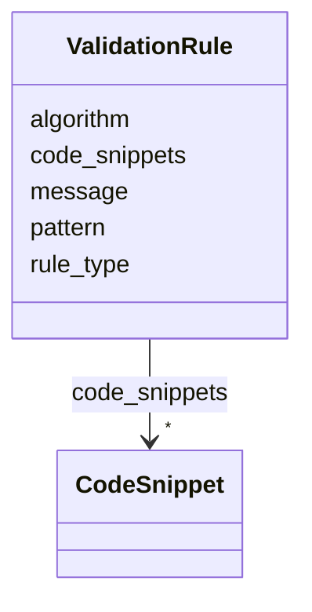

---
search:
  boost: 10.0
---

# Class: ValidationRule


_A rule defining syntactical or logical validation of values._


<div data-search-exclude markdown="1">


URI: [sdt:ValidationRule](https://w3id.org/dartfx/semanticdt/ValidationRule)





<!-- no inheritance hierarchy -->

## Slots

| Name | Cardinality and Range | Description | Inheritance |
| ---  | --- | --- | --- |
| [rule_type](rule_type.md) | 1 <br/> [String](String.md) | Type of validation (e | direct |
| [pattern](pattern.md) | 0..1 <br/> [String](String.md) | Regular expression pattern for validation | direct |
| [algorithm](algorithm.md) | 0..1 <br/> [String](String.md) | Algorithmic checker name (e | direct |
| [message](message.md) | 0..1 <br/> [String](String.md) | Error message when validation fails | direct |
| [code_snippets](code_snippets.md) | * <br/> [CodeSnippet](CodeSnippet.md) | Environment-specific code snippets or expressions implementing the validation... | direct |


## Usages

| used by | used in | type | used |
| ---  | --- | --- | --- |
| [SemanticDataType](SemanticDataType.md) | [validation_rules](validation_rules.md) | range | [ValidationRule](ValidationRule.md) |


## Identifier and Mapping Information


### Schema Source


* from schema: https://w3id.org/dartfx/semanticdt


## Mappings

| Mapping Type | Mapped Value |
| ---  | ---  |
| self | sdt:ValidationRule |
| native | sdt:ValidationRule |


## LinkML Source

<!-- TODO: investigate https://stackoverflow.com/questions/37606292/how-to-create-tabbed-code-blocks-in-mkdocs-or-sphinx -->

### Direct

<details>
```yaml
name: ValidationRule
description: A rule defining syntactical or logical validation of values.
from_schema: https://w3id.org/dartfx/semanticdt
attributes:
  rule_type:
    name: rule_type
    description: Type of validation (e.g., regex, checksum, range).
    from_schema: https://w3id.org/dartfx/semanticdt
    rank: 1000
    domain_of:
    - ValidationRule
    required: true
  pattern:
    name: pattern
    description: Regular expression pattern for validation.
    from_schema: https://w3id.org/dartfx/semanticdt
    rank: 1000
    domain_of:
    - ValidationRule
  algorithm:
    name: algorithm
    description: Algorithmic checker name (e.g., luhn, modulo-11, isbn13).
    from_schema: https://w3id.org/dartfx/semanticdt
    rank: 1000
    domain_of:
    - ValidationRule
  message:
    name: message
    description: Error message when validation fails.
    from_schema: https://w3id.org/dartfx/semanticdt
    rank: 1000
    domain_of:
    - ValidationRule
  code_snippets:
    name: code_snippets
    description: Environment-specific code snippets or expressions implementing the
      validation logic.
    from_schema: https://w3id.org/dartfx/semanticdt
    rank: 1000
    domain_of:
    - ValidationRule
    - GenerationRule
    range: CodeSnippet
    multivalued: true

```
</details>

### Induced

<details>
```yaml
name: ValidationRule
description: A rule defining syntactical or logical validation of values.
from_schema: https://w3id.org/dartfx/semanticdt
attributes:
  rule_type:
    name: rule_type
    description: Type of validation (e.g., regex, checksum, range).
    from_schema: https://w3id.org/dartfx/semanticdt
    rank: 1000
    owner: ValidationRule
    domain_of:
    - ValidationRule
    range: string
    required: true
  pattern:
    name: pattern
    description: Regular expression pattern for validation.
    from_schema: https://w3id.org/dartfx/semanticdt
    rank: 1000
    owner: ValidationRule
    domain_of:
    - ValidationRule
    range: string
  algorithm:
    name: algorithm
    description: Algorithmic checker name (e.g., luhn, modulo-11, isbn13).
    from_schema: https://w3id.org/dartfx/semanticdt
    rank: 1000
    owner: ValidationRule
    domain_of:
    - ValidationRule
    range: string
  message:
    name: message
    description: Error message when validation fails.
    from_schema: https://w3id.org/dartfx/semanticdt
    rank: 1000
    owner: ValidationRule
    domain_of:
    - ValidationRule
    range: string
  code_snippets:
    name: code_snippets
    description: Environment-specific code snippets or expressions implementing the
      validation logic.
    from_schema: https://w3id.org/dartfx/semanticdt
    rank: 1000
    owner: ValidationRule
    domain_of:
    - ValidationRule
    - GenerationRule
    range: CodeSnippet
    multivalued: true

```
</details></div>
